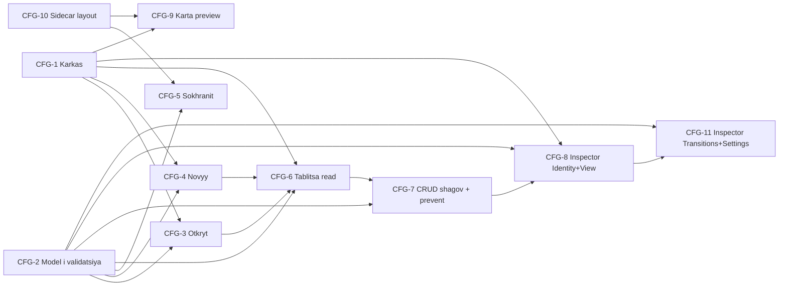

# Incident Manager — Configurator (Web). MVP. Подзадачи для команды

> Декомпозиция задачи «WEB-конфигуратор сценариев Incident Manager DSL v1» на 11 подзадач для постановки в Jira. ТЗ платформо-независимое — стек выбирает команда. Контракт данных — [`dsl-v1-schema.json`](https://github.com/olegvphoenix/incident-manager-dsl/blob/main/dsl-v1-schema.json), пояснения — [`dsl-v1-draft.md`](https://github.com/olegvphoenix/incident-manager-dsl/blob/main/dsl-v1-draft.md).

## Контекст

Цель MVP — дать конфигуратору сценариев возможность открыть/создать/сохранить DSL-документ, отредактировать список шагов в виртуализированной таблице, отредактировать поля выбранного шага в правой панели Inspector, увидеть граф переходов в режиме preview (без редактирования рёбер). Прототип, на основе которого строилась декомпозиция, доступен онлайн и в репозитории — см. ссылки в каждом тикете.

- **Живой прототип:** http://82.38.66.177:8080/configurator/
- **Репозиторий (публичный):** https://github.com/olegvphoenix/incident-manager-dsl, ветка `main`
- **DSL-спецификация:** [`dsl-v1-draft.md`](https://github.com/olegvphoenix/incident-manager-dsl/blob/main/dsl-v1-draft.md)
- **JSON Schema (контракт):** [`dsl-v1-schema.json`](https://github.com/olegvphoenix/incident-manager-dsl/blob/main/dsl-v1-schema.json)
- **Sidecar layout (формат):** [`configurator-web/src/types/layout.ts`](https://github.com/olegvphoenix/incident-manager-dsl/blob/main/configurator-web/src/types/layout.ts)
- **Примеры сценариев:** [`examples/`](https://github.com/olegvphoenix/incident-manager-dsl/tree/main/examples)

## Принципы

- **Платформо-независимое ТЗ.** Ни одного упоминания React / Zustand / MUI / ReactFlow / Vite. Прототип в репо — референс UX и edge-cases, переиспользовать код не обязательно.
- **Превентивная валидация вместо панели диагностики.** Действия, ведущие к нарушению JSON Schema или к семантически «битому» сценарию, либо блокируются (disabled + tooltip с объяснением), либо требуют разрешения конфликта в том же действии. Ошибки видны inline в полях/строках/узлах. При попытке Save — модальный список ошибок «Сохранение невозможно».
- **Layout — отдельно от DSL.** Координаты узлов хранятся в sidecar-файле `<name>.layout.json`. В DSL координат нет (это П1 спецификации).
- **Каждая подзадача 1–3 дня одному разработчику**, имеет проверяемые AC и явные входы/выходы.

## Состав MVP (11 тикетов, 4 эпика)

- Эпик A. **Каркас и работа с файлами:** CFG-1, CFG-2, CFG-3, CFG-4, CFG-5
- Эпик B. **Табличный редактор шагов:** CFG-6, CFG-7
- Эпик C. **Inspector (правая панель):** CFG-8, CFG-11
- Эпик D. **Карта переходов (preview):** CFG-9, CFG-10

## Граф зависимостей



После готовности CFG-1 и CFG-2 параллелизуются ветки: «файлы» (CFG-3, CFG-4, CFG-10, CFG-5), «таблица» (CFG-6, CFG-7), «inspector» (CFG-8 → CFG-11), «граф» (CFG-9 после CFG-10).

## Out of scope MVP (вынесено за рамки)

- Редактирование Flow (connect / reconnect / delete-edge).
- Диагностическая панель — заменена превентивной валидацией.
- Step preview в Inspector («так увидит оператор»).
- Live-Preview через runner-web (iframe + postMessage).
- Undo / Redo с историей операций.
- Редактор условных правил (`transitions.rules`) и JSONLogic Visual / Raw builder. Правила в этом MVP только отображаются на графе как рёбра; редактируется только `default`.
- Хоткеи кроме Ctrl/Cmd+S.
- Темизация, локализация (текст UI — русский, как в прототипе).

## Контракт sidecar layout (для CFG-5, CFG-9, CFG-10)

```json
{
  "layoutVersion": "1.0",
  "scenarioRef": { "scenarioGuid": "<uuid>", "version": 1 },
  "etag": "<sha1 от отсортированного списка step.id, через запятую>",
  "viewport": { "x": 0, "y": 0, "zoom": 1 },
  "nodes": {
    "<stepId>": { "x": 120, "y": 80 },
    "__end_<stepId>": { "x": 360, "y": 80 }
  }
}
```

---

# CFG-1. Каркас приложения и базовый layout

**Title:** Каркас веб-приложения конфигуратора (Toolbar + Workspace + переключатель видов)

**User story:** As a разработчик команды, I want иметь рабочий каркас SPA с верхней панелью действий, центральной рабочей областью и переключателем «Таблица / Карта переходов», so that последующие фичи можно добавлять в готовый layout, не трогая структуру.

## Описание

Создать пустое работоспособное SPA. Сверху — Toolbar (логотип, имя сценария, действия «Новый», «Открыть», «Сохранить», переключатель вида «Таблица / Карта переходов»). Центр — рабочая область, в которой пока показывается «пустое состояние» (нет открытого сценария). Никакой бизнес-логики на этом шаге не реализуется — это скелет, в который последующие тикеты добавят таблицу, граф, Inspector. Inspector-колонка зарезервирована справа (300–360px), но пока пустая (placeholder). Layout — grid: верхняя строка `48px`, центральная `1fr`, правая колонка фиксированной ширины.

## UI (wireframes)

Основной экран, нет открытого сценария:

```text
+------------------------------------------------------------------------------+
| [Logo] Incident Manager — Configurator   [Новый] [Открыть] [Сохранить]       |
|                                          (Таблица|Карта переходов)           |
+--------------------------------------------------+---------------------------+
|                                                  |                           |
|              (рабочая область пуста)             |     Inspector             |
|                                                  |     (panel placeholder)   |
|        Откройте сценарий или создайте новый      |                           |
|              [ Новый ]   [ Открыть ]             |                           |
|                                                  |                           |
+--------------------------------------------------+---------------------------+
```

Состояние «сценарий открыт» (показывается имя и `dirty`-индикатор):

```text
+------------------------------------------------------------------------------+
| [Logo] ... · Тревога периметра · v3 · *      [Новый] [Открыть] [Сохранить]   |
|                                              (Таблица|Карта переходов)       |
+--------------------------------------------------+---------------------------+
|                                                  |                           |
|              <Таблица или Карта переходов>       |   <Inspector контент>     |
|                                                  |                           |
+--------------------------------------------------+---------------------------+
```

Состояние ошибки загрузки сценария (баннер сверху рабочей области):

```text
+--------------------------------------------------+---------------------------+
| ⚠ Не удалось открыть файл: <текст ошибки>  [×]   |                           |
+--------------------------------------------------+                           |
|                                                  |                           |
|             (рабочая область пуста)              |                           |
+--------------------------------------------------+---------------------------+
```

## Ссылки

- Живой UI: http://82.38.66.177:8080/configurator/ (открывается с пустым состоянием)
- Прототип (исходники, GitHub, ветка `main`):
  - [`configurator-web/src/main.tsx`](https://github.com/olegvphoenix/incident-manager-dsl/blob/main/configurator-web/src/main.tsx)
  - [`configurator-web/src/views/AppShell.tsx`](https://github.com/olegvphoenix/incident-manager-dsl/blob/main/configurator-web/src/views/AppShell.tsx)
  - [`configurator-web/src/views/Toolbar.tsx`](https://github.com/olegvphoenix/incident-manager-dsl/blob/main/configurator-web/src/views/Toolbar.tsx)
  - [`configurator-web/src/views/WorkspacePlaceholder.tsx`](https://github.com/olegvphoenix/incident-manager-dsl/blob/main/configurator-web/src/views/WorkspacePlaceholder.tsx)

## Acceptance criteria

- При открытии URL-приложения видны: верхний Toolbar с логотипом, заголовком, кнопками `Новый` / `Открыть` / `Сохранить`, переключателем `Таблица / Карта переходов`.
- При отсутствии открытого сценария центральная область показывает пустое состояние с кнопками `Новый` и `Открыть`.
- Правая колонка зарезервирована под Inspector (фиксированная ширина 300–360px), на этом шаге показывает placeholder «Выберите шаг или создайте сценарий».
- Переключатель `Таблица / Карта переходов` — рабочий: переключает значение в state, но обе кнопки пока ведут на пустое состояние (контент будет в CFG-6 и CFG-9).
- `Сохранить` — disabled, пока сценарий не открыт.
- Скелет адаптивен в пределах десктопа (1280–2560px), не ломается при ресайзе окна.

## Зависимости

Нет.

## Ориентир по объёму

S.

## Out of scope тикета

Никакой бизнес-логики (работы с DSL), валидации, файлов. Только скелет.

---

# CFG-2. Модель данных DSL v1 и валидация по JSON Schema

**Title:** Типы DSL v1, парсер и валидация JSON Schema (Level 1)

**User story:** As a разработчик, I want type-safe модель сценария и проверку входного JSON по схеме, so that остальные фичи редактора могут работать с гарантированно валидной структурой.

## Описание

Реализовать в выбранном стеке типы (или эквивалент: TypeScript / Pydantic / DTO / etc.), полностью описывающие сценарий DSL v1, включая 7 типов шагов (`Button`, `RadioButton`, `Checkbox`, `Select`, `Comment`, `Image`, `Datetime`), `transitions` (rules + default), `actions` (`callMacro`, `finish`, `generateReport`, `escalate`, `assign`), метаданные сценария. Реализовать валидатор: принимает произвольный JSON, валидирует по [`dsl-v1-schema.json`](https://github.com/olegvphoenix/incident-manager-dsl/blob/main/dsl-v1-schema.json), возвращает либо `{ ok: true, scenario }`, либо `{ ok: false, errors: [{path, message}, ...] }`. Покрыть юнит-тестами на 10 примерах из [`examples/`](https://github.com/olegvphoenix/incident-manager-dsl/tree/main/examples).

## UI (wireframes)

Без UI. Это библиотечный/инфраструктурный тикет.

## Ссылки

- Прототип:
  - [`configurator-web/src/types/dsl.ts`](https://github.com/olegvphoenix/incident-manager-dsl/blob/main/configurator-web/src/types/dsl.ts)
  - [`configurator-web/src/types/layout.ts`](https://github.com/olegvphoenix/incident-manager-dsl/blob/main/configurator-web/src/types/layout.ts)
  - [`configurator-web/src/services/validation.ts`](https://github.com/olegvphoenix/incident-manager-dsl/blob/main/configurator-web/src/services/validation.ts)
- Контракт: [`dsl-v1-schema.json`](https://github.com/olegvphoenix/incident-manager-dsl/blob/main/dsl-v1-schema.json), [`dsl-v1-draft.md`](https://github.com/olegvphoenix/incident-manager-dsl/blob/main/dsl-v1-draft.md)
- Тестовые данные: [`examples/`](https://github.com/olegvphoenix/incident-manager-dsl/tree/main/examples)

## Acceptance criteria

- Типы покрывают все 7 типов шагов и обе ветки `transitions` (`rules`, `default`).
- Валидатор принимает произвольный JSON и возвращает структурированный результат (ok / список ошибок с JSON-path до проблемного поля).
- Все 10 файлов из [`examples/`](https://github.com/olegvphoenix/incident-manager-dsl/tree/main/examples) валидируются как `ok`.
- Тест с искусственно «битыми» JSON (отсутствует `initialStepId`, дубль `id`, неизвестный `type`, пустой `options` для `RadioButton`) возвращает соответствующие ошибки.
- Schema подключается как ассет/ресурс (а не копируется в код), путь к файлу — единый для всего проекта.

## Зависимости

Нет.

## Ориентир по объёму

M.

## Out of scope тикета

Семантическая (Level 2) валидация: orphan/unreachable/dangling — не в этом тикете. UI ошибок — в CFG-3 и CFG-5.

---

# CFG-3. Открытие сценария из файла

**Title:** Открытие сценария и опционально sidecar layout из файла

**User story:** As a инженер-конфигуратор, I want открыть на диске JSON-файл сценария (и опционально его layout), so that начать его редактировать в конфигураторе.

## Описание

Кнопка `Открыть` в Toolbar открывает диалог выбора одного или двух файлов: основной `<name>.json` (DSL) и опциональный `<name>.layout.json` (sidecar). Различение происходит по имени (`*.layout.json`) или по содержимому (`layoutVersion: "1.0"`). Перед загрузкой — валидация по схеме (см. CFG-2). При ошибке валидации — диалог-список ошибок и **отказ открыть** (старый сценарий, если был открыт, остаётся). При успехе — сценарий и layout попадают в state, в Toolbar показывается `metadata.name · v<version>`. Если выбран только `<name>.json` без layout — сценарий открывается, layout будет создан авто-расстановкой при первом показе графа (см. CFG-9, CFG-10).

## UI (wireframes)

Кнопка `Открыть` (в Toolbar):

```text
... [Новый] [Открыть] [Сохранить] ...
```

Нативный диалог выбора файлов (схематично):

```text
+------------- Открыть файл(ы) -------------+
|  📁 examples/                              |
|    📄 02-fire-alarm.json                   |
|    📄 02-fire-alarm.layout.json            |
|    ...                                     |
|  [✓ Несколько файлов]      [Открыть]       |
+--------------------------------------------+
```

Успешная загрузка — снэк/тост (исчезает через 3 сек):

```text
+----------------------------------------------+
| ✓ Открыт: 02-fire-alarm.json + layout        |
+----------------------------------------------+
```

Ошибка валидации — модал-блокер с возможностью скопировать ошибки:

```text
+============= Не удалось открыть файл ===============+
|  Файл не соответствует DSL v1 schema:               |
|                                                     |
|   ✗ /steps/2/view: required field "options" missing |
|   ✗ /steps/3/transitions/default: must be object    |
|                                                     |
|  Исправьте файл во внешнем редакторе и попробуйте   |
|  снова.                                             |
|                                                     |
|        [Скопировать ошибки]    [Закрыть]            |
+=====================================================+
```

Ошибка чтения (нет прав, битый JSON):

```text
+========== Не удалось прочитать файл ==========+
|  ✗ Unexpected token in JSON at position 142   |
|                                               |
|             [Закрыть]                         |
+===============================================+
```

## Ссылки

- Живой UI: http://82.38.66.177:8080/configurator/ → Toolbar → `Открыть`
- Прототип:
  - [`configurator-web/src/services/scenarioIO.ts`](https://github.com/olegvphoenix/incident-manager-dsl/blob/main/configurator-web/src/services/scenarioIO.ts)
  - [`configurator-web/src/store/editorStore.ts`](https://github.com/olegvphoenix/incident-manager-dsl/blob/main/configurator-web/src/store/editorStore.ts) — функция `loadScenario`
- Тестовые данные: [`examples/`](https://github.com/olegvphoenix/incident-manager-dsl/tree/main/examples) (есть пары `*.json` + `*.layout.json`)

## Acceptance criteria

- Кнопка `Открыть` открывает нативный диалог выбора файлов с включённым multi-select.
- Если выбран один файл `<name>.json` — открывается без layout.
- Если выбраны два файла `<name>.json` + `<name>.layout.json` — оба применяются. Различение по имени `*.layout.json` ИЛИ по полю `layoutVersion` в содержимом.
- При ошибке валидации по схеме показывается модал-блокер со списком ошибок (JSON-path + текст). Сценарий не открывается, прежний state остаётся.
- При ошибке чтения (битый JSON, нет прав) — отдельный модал «Не удалось прочитать файл».
- В Toolbar отображается `metadata.name · v<version>` после успешного открытия.
- Открытие любого из 10 файлов из [`examples/`](https://github.com/olegvphoenix/incident-manager-dsl/tree/main/examples) проходит без ошибок.

## Зависимости

CFG-1, CFG-2.

## Ориентир по объёму

M.

## Out of scope тикета

Подбор layout-файла «на лету» по имени основного. Drag&drop файла в окно (не нужно в MVP). Семантическая валидация (orphans / unreachable) — для них поведение «открыть, но показать предупреждения» делается в рамках превентивной валидации в других тикетах.

---

# CFG-4. Создание нового пустого сценария

**Title:** Кнопка «Новый» — создать минимальный валидный сценарий

**User story:** As a инженер-конфигуратор, I want одним кликом создать пустой сценарий с шагом-заглушкой, so that начать сборку с нуля без необходимости готовить файл во внешнем редакторе.

## Описание

Кнопка `Новый` в Toolbar создаёт минимальный сценарий, валидный по схеме: `metadata.scenarioGuid` = новый UUID v4, `metadata.version` = 1, `metadata.name` = «Новый сценарий», один шаг типа `Button` с `id: "step_1"`, `view.label: "Шаг 1"`, `initialStepId = "step_1"`. После создания пользователь видит таблицу с одной строкой и Inspector сразу с заполненной формой выбранного шага. Если до этого был открыт другой сценарий с несохранёнными изменениями — показать confirm «Несохранённые изменения будут потеряны. Продолжить?».

## UI (wireframes)

Кнопка `Новый` в Toolbar:

```text
... [Новый] [Открыть] [Сохранить] ...
```

После клика — таблица c одной строкой:

```text
+----+---------+---------+----------+----------+----------+
| #  | id      | type    | title    | editable | next     |
+----+---------+---------+----------+----------+----------+
| ▶1 | step_1  | Button  | Шаг 1    |    —     | (нет)    |
+----+---------+---------+----------+----------+----------+
```

Confirm при потере изменений:

```text
+======== Несохранённые изменения ========+
|  В текущем сценарии есть несохранённые  |
|  изменения. Создать новый?              |
|                                         |
|       [Отмена]   [Создать новый]        |
+=========================================+
```

## Ссылки

- Живой UI: http://82.38.66.177:8080/configurator/ → Toolbar → `Новый`
- Прототип:
  - [`configurator-web/src/services/newScenario.ts`](https://github.com/olegvphoenix/incident-manager-dsl/blob/main/configurator-web/src/services/newScenario.ts)
  - [`configurator-web/src/store/stepFactories.ts`](https://github.com/olegvphoenix/incident-manager-dsl/blob/main/configurator-web/src/store/stepFactories.ts)

## Acceptance criteria

- После клика `Новый` создаётся валидный (по схеме) сценарий с одним шагом.
- `scenarioGuid` — UUID v4, новый при каждом клике.
- `metadata.name = "Новый сценарий"`, `metadata.version = 1`.
- Шаг по умолчанию: `type: "Button"`, `id: "step_1"`, `view.label: "Шаг 1"`, `initialStepId = "step_1"`.
- В таблице отображается одна строка, она помечена как `initial`.
- Если в state были несохранённые изменения — показывается confirm.
- Сценарий «грязный» (`dirty = true`) сразу после создания (он ещё не сохранён).

## Зависимости

CFG-1, CFG-2.

## Ориентир по объёму

S.

## Out of scope тикета

Шаблоны сценариев (несколько preset'ов), wizard выбора типа стартового шага.

---

# CFG-5. Сохранение сценария и layout

**Title:** Кнопка «Сохранить» (DSL + sidecar) с превентивной валидацией

**User story:** As a инженер-конфигуратор, I want сохранить сценарий и его layout в файлы на диске, so that вернуться к нему позже или отдать в систему-исполнитель.

## Описание

Кнопка `Сохранить` в Toolbar и хоткей Ctrl/Cmd+S. Перед сохранением выполняется финальная валидация по схеме (CFG-2) и превентивная семантическая проверка (нет orphan-ссылок в `goto`, есть `initialStepId`, ни один шаг не «зависший» — у каждого либо `default.goto`, либо terminal-action). Если есть ошибки — модал-блокер «Сохранение невозможно» со списком ошибок и кликабельной навигацией к шагу/полю. Если ошибок нет — сохраняем два файла: `<name>.json` (DSL без координат) и `<name>.layout.json` (sidecar с `nodes`, `viewport`, `etag`). Поведение: если файлы открывались с диска — перезаписываем в исходные пути; иначе — диалог сохранения / два скачивания (fallback). После успешного сохранения — `dirty = false`, в Toolbar убирается звёздочка.

## UI (wireframes)

Кнопка `Сохранить` (active и disabled):

```text
... [Новый] [Открыть] [Сохранить]  ←  active, есть изменения
... [Новый] [Открыть] [Сохранить ⊘] ←  disabled, нет изменений ИЛИ нет открытого сценария
```

Индикатор `dirty` в Toolbar:

```text
... · Тревога периметра · v3 · * ...      ← * = есть несохранённые изменения
... · Тревога периметра · v3   ...        ← без * = всё сохранено
```

Fallback при сохранении нового сценария (не открывался с диска):

```text
+============ Сохранить как ============+
|  Имя файла:  [my-scenario_______]      |
|  ┌──────────────────────────────────┐  |
|  │ Будут сохранены два файла:       │  |
|  │   my-scenario.json               │  |
|  │   my-scenario.layout.json        │  |
|  └──────────────────────────────────┘  |
|                                        |
|        [Отмена]   [Сохранить]          |
+========================================+
```

Tост успеха:

```text
+----------------------------------------------+
| ✓ Сохранено: my-scenario.json + layout       |
+----------------------------------------------+
```

Модал-блокер при попытке Save с ошибками (превентивная валидация):

```text
+========= Сохранение невозможно =========+
|  Исправьте, чтобы сохранить:            |
|                                         |
|   ✗ Шаг "step_3": ссылка goto → "step_x"|
|     не существует    [Перейти к шагу]   |
|   ✗ Шаг "step_5": нет default.goto и    |
|     нет terminal-action [Перейти]       |
|   ✗ Не задан initialStepId  [Назначить] |
|                                         |
|             [Закрыть]                   |
+=========================================+
```

## Ссылки

- Живой UI: http://82.38.66.177:8080/configurator/ → внести изменение → `Сохранить` (или Ctrl+S)
- Прототип:
  - [`configurator-web/src/services/saveScenario.ts`](https://github.com/olegvphoenix/incident-manager-dsl/blob/main/configurator-web/src/services/saveScenario.ts)
  - [`configurator-web/src/services/etag.ts`](https://github.com/olegvphoenix/incident-manager-dsl/blob/main/configurator-web/src/services/etag.ts)
  - [`configurator-web/src/hooks/useGlobalHotkeys.ts`](https://github.com/olegvphoenix/incident-manager-dsl/blob/main/configurator-web/src/hooks/useGlobalHotkeys.ts)

## Acceptance criteria

- Кнопка `Сохранить` и хоткей Ctrl/Cmd+S работают одинаково.
- Перед сохранением запускается валидация: JSON Schema + семантические проверки (orphan goto, missing initial, dead-end default). При ошибках — модал-блокер, файлы не пишутся.
- В случае успеха сохраняются два файла: `<name>.json` (DSL без координат, без полей `x`/`y`) и `<name>.layout.json` (sidecar по контракту в шапке этого документа).
- Если файлы открывались с диска (есть file handle) — перезаписываются в те же пути без диалога.
- Если сохранение «нового» сценария (или fallback в браузере без File System Access) — диалог сохранения / два скачивания.
- После успешного сохранения `dirty = false`, звёздочка в Toolbar исчезает, показывается toast «Сохранено».
- В sidecar `etag` пересчитывается перед записью (sha1 от отсортированного списка `step.id`).

## Зависимости

CFG-2, CFG-10.

## Ориентир по объёму

M.

## Out of scope тикета

Версионирование на сервере (proposal-versioning). Сохранение в облако / в server-API. Auto-save.

---

# CFG-6. Табличный список шагов (read-only view)

**Title:** Виртуализированная таблица шагов с поиском и фильтром

**User story:** As a инженер-конфигуратор, I want видеть все шаги сценария списком с возможностью искать и фильтровать, so that ориентироваться даже в крупных сценариях (50+ шагов).

## Описание

Виртуализированная таблица: 7 колонок — `#` (порядковый номер с маркером initial), `id`, `type`, `title`, `editable`, `outgoing` (краткая сводка по `default.goto` или terminal-action), `marker` (превентивные предупреждения, если шаг «битый»). Поиск по `id`/`title`/`type`. Фильтр по типу шага. Подсветка строки `initialStepId`. Hover-строка имеет фоновое выделение. Клик на строку → выбор шага → открытие/наполнение Inspector (CFG-8). Длинные значения обрезаются с ellipsis + tooltip.

## UI (wireframes)

Основная таблица с данными:

```text
+------------------------------------------------------------------------------+
| Поиск: [____________]   Фильтр по типу: [Все ▾]              30 шагов        |
+----+------------------+-----------+--------------------+-----------+---------+
| #  | id               | type      | title              | editable  | next    |
+----+------------------+-----------+--------------------+-----------+---------+
| ▶1 | confirm_alarm    | Button    | Подтвердить тревогу|     —     | → step2 |
|  2 | classify         | Select    | Классификация      |     ✓     | → step5 |
|  3 | take_photo       | Image     | Фото с места       |     ✓     | → step5 |
|  4 | finish_report    | Comment   | Комментарий        |     ✓     | ⚑ finish|
| ⚠5 | broken_step      | Select    | (нет outgoing)     |     ✓     | (нет)   |
+----+------------------+-----------+--------------------+-----------+---------+

Легенда: ▶ = initialStepId; → = goto на шаг; ⚑ = terminal-action; ⚠ = битый шаг.
```

Hover/selected-строка:

```text
| ▶1 | confirm_alarm    | Button    | Подтвердить тревогу|     —     | → step2 |
|░░2░|░classify░░░░░░░░░|░Select░░░░|░Классификация░░░░░░|░░░░✓░░░░░░|░→ step5░|  ← hover
|██3█|█take_photo███████|█Image█████|█Фото с места███████|████✓██████|█→ step5█|  ← selected
```

Пустой результат поиска:

```text
+------------------------------------------------------------------------------+
| Поиск: [xyz_________]   Фильтр по типу: [Все ▾]                              |
+------------------------------------------------------------------------------+
|                                                                              |
|                       Ничего не найдено по запросу "xyz"                     |
|                                                                              |
+------------------------------------------------------------------------------+
```

Длинное значение (overflow):

```text
| ⚠5 | very_long_step_id_that_exc... | Comment | Длинный заголовок ... |   ✓   |
                       ↑ tooltip = полное значение            ↑ tooltip = полное
```

Маркер ⚠ с tooltip-сводкой (превентивная диагностика на строке):

```text
| ⚠5 | broken_step      | Select    | ...                |     ✓     | (нет)   |
   ↑ tooltip:
     • default.goto не задан и нет terminal-action
     • опции пусты, шаг не сможет работать
```

## Ссылки

- Живой UI: http://82.38.66.177:8080/configurator/ → `Пример` → `10-mass-event-protocol` → `Таблица`
- Прототип:
  - [`configurator-web/src/views/table/`](https://github.com/olegvphoenix/incident-manager-dsl/tree/main/configurator-web/src/views/table)

## Acceptance criteria

- Таблица отображает все шаги сценария с колонками `#`, `id`, `type`, `title`, `editable`, `outgoing`, `marker`.
- Виртуализация: при 1000+ шагов прокрутка плавная (60fps на типовом ноутбуке).
- Поиск фильтрует по `id`, `title`, `type` (case-insensitive, подстрока).
- Фильтр по типу — dropdown с 7 значениями + «Все».
- Строка `initialStepId` визуально выделена маркером ▶.
- Hover-строка подсвечивается; клик выбирает шаг (передаёт в state).
- Длинные значения обрезаются с ellipsis + tooltip с полным значением.
- Колонка `marker` показывает ⚠ для шагов с проблемами (нет outgoing, пустые options и т.п.) с подробным tooltip.
- Пустой результат поиска показывает соответствующее сообщение.

## Зависимости

CFG-1, CFG-2, CFG-3 / CFG-4 (источник данных).

## Ориентир по объёму

M.

## Out of scope тикета

Inline-редактирование (id, title, type, editable) — это CFG-7. Drag&drop reorder — не в MVP. Bulk-операции (выбрать несколько строк) — не в MVP.

---

# CFG-7. CRUD шагов в таблице с превентивной валидацией

**Title:** Создать / удалить / дублировать / переименовать шаг + назначить initial — с блокировкой невалидных операций

**User story:** As a инженер-конфигуратор, I want добавлять, удалять, дублировать и переименовывать шаги прямо в таблице, so that собирать структуру сценария без переключения в другие экраны. Невалидные операции должны блокироваться UI до того, как сценарий станет «битым».

## Описание

Действия в таблице:

- **Добавить шаг.** Кнопка `+ Шаг` в Toolbar или над таблицей: меню с 7 типами (`Button`, `RadioButton`, `Checkbox`, `Select`, `Comment`, `Image`, `Datetime`). Новый шаг вставляется в конец, получает уникальный `id` (`step_2`, `step_3`, …; если занято — `_2`, `_3`), дефолтный `view` под выбранный тип.
- **Удалить шаг.** Меню действий строки (или иконка). **Превентивная блокировка**: если на шаг ссылается `goto` другого шага — кнопка `Удалить` disabled с tooltip «На этот шаг ссылаются N шагов: …». В этом случае предлагается альтернатива «Удалить и обнулить ссылки» через явный confirm.
- **Удалить initial-шаг** — заблокировано, требует сначала назначить другой шаг initial.
- **Дублировать шаг.** Создаёт копию с новым `id` (`<id>_copy` или `<id>_2` если занято), `transitions` копируются как есть.
- **Переименовать `id`.** Inline-редактирование в ячейке. **Превентивная валидация**: regex `^[a-z][a-z0-9_]{0,63}$` + проверка уникальности. Невалидное значение — поле красное, сохранение заблокировано (Esc отменяет). При успешном rename автоматически обновляются все ссылки `goto` в `transitions` всех шагов.
- **Назначить начальным.** В ячейке `#` иконка-стрелка ▶ для назначения. Старый initial теряет маркер. Confirm не требуется.

## UI (wireframes)

Меню `+ Шаг`:

```text
[+ Шаг ▾]
   ├─ + Button
   ├─ + RadioButton
   ├─ + Checkbox
   ├─ + Select
   ├─ + Comment
   ├─ + Image
   └─ + Datetime
```

Inline rename `id` (валидное):

```text
| 3 | [take_photo_2_____]✓ | Image  | ... |
                ↑ зелёная рамка, Enter / blur — Save
```

Inline rename `id` (невалидное, дубль):

```text
| 3 | [classify_________]✗ | Image  | ... |
                ↑ красная рамка
                ✗ tooltip: "id уже используется в шаге #2"
   Save заблокирован, Enter не срабатывает, Esc отменяет.
```

Inline rename `id` (невалидное, regex):

```text
| 3 | [Take Photo!______]✗ | Image  | ... |
                ↑ красная рамка
                ✗ tooltip: "id должен начинаться с буквы и содержать только a-z, 0-9, _"
```

Меню действий строки:

```text
| 3 | take_photo  | Image  | Фото с места | ✓ | → step5 | [⋮]
                                                          ↓
                                                        ┌─────────────────────┐
                                                        │ ▶ Сделать начальным │
                                                        │ ⎘ Дублировать       │
                                                        │ ✎ Переименовать     │
                                                        │ ─────────────────── │
                                                        │ 🗑 Удалить          │
                                                        └─────────────────────┘
```

Меню действий, `Удалить` заблокировано (на шаг ссылаются другие):

```text
                                                        ┌─────────────────────┐
                                                        │ ▶ Сделать начальным │
                                                        │ ⎘ Дублировать       │
                                                        │ ✎ Переименовать     │
                                                        │ ─────────────────── │
                                                        │ 🗑 Удалить ⊘        │
                                                        │   (на этот шаг      │
                                                        │   ссылаются 2 шага: │
                                                        │   classify, fork_a) │
                                                        │ ─────────────────── │
                                                        │ 🗑 Удалить и обну-  │
                                                        │   лить ссылки       │
                                                        └─────────────────────┘
```

Confirm «Удалить и обнулить ссылки»:

```text
+======= Удалить шаг "take_photo"? =======+
|  Будут обнулены ссылки на этот шаг в:   |
|    • classify (default.goto)            |
|    • fork_a (default.goto)              |
|                                         |
|  После удаления эти шаги станут         |
|  «битыми» (нет outgoing). Исправьте     |
|  их в Inspector перед сохранением.      |
|                                         |
|       [Отмена]   [Удалить и обнулить]   |
+=========================================+
```

Попытка удалить initial:

```text
                                                        ┌─────────────────────┐
                                                        │ 🗑 Удалить ⊘        │
                                                        │   (это начальный    │
                                                        │   шаг — сначала     │
                                                        │   назначьте другой) │
                                                        └─────────────────────┘
```

## Ссылки

- Живой UI: http://82.38.66.177:8080/configurator/ → таблица → меню действий строки
- Прототип:
  - [`configurator-web/src/store/actions.ts`](https://github.com/olegvphoenix/incident-manager-dsl/blob/main/configurator-web/src/store/actions.ts) — `addStep`, `removeStep`, `duplicateStep`, `renameStep`
  - [`configurator-web/src/store/stepFactories.ts`](https://github.com/olegvphoenix/incident-manager-dsl/blob/main/configurator-web/src/store/stepFactories.ts) — дефолтные `view` для 7 типов
  - [`configurator-web/src/views/Toolbar.tsx`](https://github.com/olegvphoenix/incident-manager-dsl/blob/main/configurator-web/src/views/Toolbar.tsx) — меню `+ Шаг`

## Acceptance criteria

- `+ Шаг` создаёт шаг выбранного типа с дефолтным `view`, уникальным `id`, добавляет в конец списка.
- Удалить шаг с входящими ссылками — `Удалить` disabled + объяснение в tooltip; альтернатива «Удалить и обнулить ссылки» доступна с confirm.
- Удалить initial-шаг — заблокировано, понятный tooltip.
- Дублировать — копия с новым `id`, тот же `view` и `transitions`.
- Inline rename `id`: валидация regex и уникальности на лету, красная рамка при невалидном, Enter/blur — Save (только если валидно), Esc — отмена.
- При rename все `goto` в `transitions` других шагов обновляются автоматически.
- Назначить начальным — ▶ переезжает на новую строку, старый initial теряет маркер.
- Все операции `dirty = true` после изменения.
- Все операции отражаются в Inspector мгновенно (если выбран изменённый шаг).

## Зависимости

CFG-2, CFG-6.

## Ориентир по объёму

M.

## Out of scope тикета

Reorder шагов (drag&drop). Bulk-операции. Editable inline для title/type/editable — это в Inspector (CFG-8).

---

# CFG-8. Inspector: правая панель — Identity + View

**Title:** Inspector — правая панель: редактирование identity и view выбранного шага

**User story:** As a инженер-конфигуратор, I want видеть и редактировать поля выбранного шага в правой панели, so that править контент без переключения экранов и сразу видеть результат в таблице/графе.

## Описание

Inspector — постоянная правая колонка (300–360px). Содержит две секции:

- **Identity:** `id` (rename + валидация как в CFG-7), `type` (Select с подтверждением смены — `view` сбрасывается на дефолтный для нового типа), `title`, `editable` (switch), кнопка/чекбокс «сделать начальным».
- **View** (зависит от типа шага): форма с полями, специфичными для типа (см. таблицу ниже). Для шагов с `options` (`RadioButton`, `Checkbox`, `Select`) — встроенный редактор опций (add / remove / reorder / переименовать `id` опции с авто-обновлением ссылок).

Когда не выбран ни один шаг — в Inspector показывается заглушка «Выберите шаг в таблице или на карте». (Scenario Settings и Transitions редактирование — в CFG-11.)

**Live-редактирование:** правки записываются в общий state по blur (текстовые поля) или сразу (switch / select). Это даёт мгновенное отражение в таблице и графе.

**Превентивная валидация в полях:**

- Невалидный `id` — красная рамка, save поля заблокирован.
- Смена типа — confirm «View будет сброшен на дефолтный».
- Удаление последней опции у `RadioButton` / `Select` / `Checkbox` — заблокировано (минимум 1 опция).
- Дубли `id` опций — красная рамка.
- В `Datetime` `min > max` — красная рамка обоих полей.
- В `Number`-полях (`minSelected > maxSelected`, `minLength > maxLength`) — аналогично.

## Поля view по типам шагов

| Тип | Поля view |
|---|---|
| `Button` | `label`, `emphasis` (primary / secondary / destructive) |
| `RadioButton` | `label`, `options[]`, `required`, `layout` (vertical / horizontal) |
| `Checkbox` | `label`, `options[]`, `required`, `minSelected`, `maxSelected`, `layout` |
| `Select` | `label`, `placeholder`, `options[]`, `required` |
| `Comment` | `label`, `placeholder`, `required`, `readonly`, `minLength`, `maxLength`, `minRows`, `maxRows` |
| `Image` | `label`, `source` (camera / map / operator / fixed), `fixedSrc`, `allowMultiple`, `required` |
| `Datetime` | `label`, `kind` (time / date / datetime), `required`, `min`, `max` |

## UI (wireframes)

Inspector с выбранным шагом `Button`:

```text
+----- Inspector --------+
|  Identity              |
|  ┌─────────────────┐   |
|  │ id              │   |
|  │ [confirm_alarm_]│   |
|  │ ⓘ a-z, 0-9, _   │   |
|  │                 │   |
|  │ type [Button ▾] │   |
|  │ title [_______] │   |
|  │ editable [✓]    │   |
|  │ [□ initial]     │   |
|  └─────────────────┘   |
|  ─────────────────     |
|  View (Button)         |
|  ┌─────────────────┐   |
|  │ label           │   |
|  │ [Подтвердить__] │   |
|  │                 │   |
|  │ emphasis        │   |
|  │ [primary ▾]     │   |
|  └─────────────────┘   |
|  ─────────────────     |
|  Transitions           |
|  → редактируется в     |
|     CFG-11             |
+------------------------+
```

Inspector с выбранным шагом `Select` (с редактором опций):

```text
+----- Inspector --------+
|  Identity ...          |
|  ─────────────────     |
|  View (Select)         |
|  ┌─────────────────┐   |
|  │ label           │   |
|  │ [Категория____] │   |
|  │ placeholder     │   |
|  │ [Выберите_____] │   |
|  │ required [✓]    │   |
|  │                 │   |
|  │ Options         │   |
|  │ ┌─────────────┐ │   |
|  │ │ ⋮ false   ✎ │ │   |
|  │ │   Ложн.   🗑│ │   |
|  │ │ ⋮ true    ✎ │ │   |
|  │ │   Истин.  🗑│ │   |
|  │ └─────────────┘ │   |
|  │ [+ Опция]       │   |
|  └─────────────────┘   |
+------------------------+
```

Confirm смены типа:

```text
+======= Сменить тип шага? =======+
|  При смене типа Select → Button |
|  view-поля будут сброшены на    |
|  дефолтные для Button.          |
|                                 |
|  Восстановить будет нельзя      |
|  (undo не поддерживается).      |
|                                 |
|       [Отмена]   [Сменить]      |
+=================================+
```

Inline-ошибка валидации `id`:

```text
|  ┌─────────────────┐   |
|  │ id              │   |
|  │ [Take Photo!__]✗│   ← красная рамка
|  │ ✗ Только a-z,   │   |
|  │   0-9, _; на-   │   |
|  │   чинаться с    │   |
|  │   буквы         │   |
|  └─────────────────┘   |
```

Попытка удалить последнюю опцию (заблокировано):

```text
|  Options         |
|  ┌─────────────┐ |
|  │ ⋮ option_1✎ │ |
|  │   Опция 1🗑⊘│ ← disabled с tooltip "Минимум 1 опция"
|  └─────────────┘ |
```

Заглушка «не выбран шаг»:

```text
+----- Inspector --------+
|                        |
|                        |
|   Выберите шаг в       |
|   таблице или на       |
|   карте, чтобы         |
|   редактировать его    |
|   поля.                |
|                        |
+------------------------+
```

## Ссылки

- Живой UI: http://82.38.66.177:8080/configurator/ → выбрать строку в таблице → правая панель
- Прототип (берём только Identity + View, без Transitions):
  - [`configurator-web/src/views/inspector/Inspector.tsx`](https://github.com/olegvphoenix/incident-manager-dsl/blob/main/configurator-web/src/views/inspector/Inspector.tsx)
  - [`configurator-web/src/views/inspector/identity/IdentityForm.tsx`](https://github.com/olegvphoenix/incident-manager-dsl/blob/main/configurator-web/src/views/inspector/identity/IdentityForm.tsx)
  - [`configurator-web/src/views/inspector/view/ViewForm.tsx`](https://github.com/olegvphoenix/incident-manager-dsl/blob/main/configurator-web/src/views/inspector/view/ViewForm.tsx)
  - [`configurator-web/src/views/inspector/view/OptionsEditor.tsx`](https://github.com/olegvphoenix/incident-manager-dsl/blob/main/configurator-web/src/views/inspector/view/OptionsEditor.tsx)

## Acceptance criteria

- Inspector — постоянная правая колонка фиксированной ширины 300–360px, видна всегда.
- Когда шаг не выбран — заглушка с подсказкой.
- Когда шаг выбран — секции Identity и View. Transitions — место зарезервировано (контент в CFG-11).
- Все 7 типов шагов имеют корректную View-форму с полями из таблицы выше.
- Редактирование — live: blur/Enter (текст), сразу (switch/select). Изменения видны в таблице/графе мгновенно.
- Валидация: невалидный `id` — красная рамка, нет записи в state. Дубли `id` опций — красная рамка. `min > max` — красная рамка. Минимум 1 опция у Radio/Select/Checkbox.
- Смена типа — confirm с явным предупреждением о сбросе view.
- Реакция на удаление выбранного шага извне (например, в таблице): Inspector показывает заглушку.
- При переименовании `id` опции в OptionsEditor автоматически обновляются ссылки на эту опцию (если они есть в `transitions.rules` — read-only в этом MVP, но визуально надо предупредить).

## Зависимости

CFG-1, CFG-2, CFG-7.

## Ориентир по объёму

L.

## Out of scope тикета

- Редактирование `transitions` (default + rules) — в CFG-11.
- Scenario Settings (имя, версия, теги, timers, concurrency) — в CFG-11.
- **Step preview / «так увидит оператор» — НЕ делать (явная правка ТЗ).**
- JSONLogic Visual Builder.
- Undo/redo по полям.

---

# CFG-9. Карта переходов (preview, read-only)

**Title:** Граф сценария — режим preview с автолейаутом

**User story:** As a инженер-конфигуратор, I want видеть сценарий как граф (узлы = шаги, рёбра = переходы), so that оценивать структуру и находить узкие места без чтения JSON.

## Описание

Режим `Карта переходов` (переключатель в Toolbar). Узлы:

- по одному узлу на каждый шаг сценария (иконка/цвет — по типу шага);
- синтетические терминальные узлы `__end_<stepId>` для default-action `finish` / `escalate` / `assign` / `generateReport` / `callMacro` (мелкие, иконка терминала).

Рёбра:

- `transitions.default.goto` — основное ребро (сплошное);
- `transitions.rules[].goto` — дополнительные рёбра (пунктир, с label-условием — текстовый дамп JSONLogic).

Подсветка стартового шага (бордер). Клик на узел = выбор шага (синхронизировано с Inspector). Drag узла → сохранение позиции в layout (это единственное допустимое редактирование на карте, всё остальное — только просмотр). Кнопка `Пересчитать расположение` — auto-layout по выбранному алгоритму (например, dagre). Контролы: zoom in/out, fit-view, мини-карта.

**Превентивная диагностика на карте:**

- узел шага с проблемой (нет outgoing, dangling goto) — красная обводка + tooltip;
- ребро на несуществующий шаг — красное (но в норме UI этого не допустит благодаря CFG-7 / CFG-11).

## UI (wireframes)

Основная карта:

```text
+------------------------------------------------------------------------------+
| [Пересчитать расположение]                       [-] [+] [⛶ fit]             |
+------------------------------------------------------------------------------+
|                                                                              |
|     ┌──────────────┐                                                         |
|     │ ▶ Button     │                                                         |
|     │ confirm_alarm│──┐                                                      |
|     └──────────────┘  │                                                      |
|                       ▼                                                      |
|              ┌──────────────┐         ┌──────────────┐                       |
|              │ Select       │────────▶│ Image        │                       |
|              │ classify     │         │ take_photo   │                       |
|              └──────────────┘         └──────┬───────┘                       |
|                                              ▼                               |
|                                        ┌──────────────┐                      |
|                                        │ ⚑ finish     │                      |
|                                        │__end_take_p..│                      |
|                                        └──────────────┘                      |
|                                                                              |
|                                            ┌── Mini-map ─┐                   |
|                                            │  ▫ ▫ ▫      │                   |
|                                            └─────────────┘                   |
+------------------------------------------------------------------------------+

Легенда:  ▶ initial   ⚑ terminal-узел   цвет/иконка = тип шага
          сплошное ребро = default.goto    пунктир = rules[].goto
```

Узел selected:

```text
                  ┌══════════════┐  ← двойная/жирная рамка
                  ║ Select       ║
                  ║ classify     ║
                  └══════════════┘
```

Узел с проблемой (превентивная диагностика):

```text
              ┌──────────────┐
              │ Select       │  ← красная обводка
              │ broken_step  │
              └──────────────┘
                  ↑ tooltip:
                  • default.goto не задан
                  • нет terminal-action
                  • опции пусты
```

Карта без layout (только что открыли сценарий без `*.layout.json`):

```text
   (узлы автоматически расставлены через dagre/аналог)
   Toast: "Layout рассчитан автоматически. Сохраните, чтобы зафиксировать."
```

Граф из одного шага:

```text
+------------------------------------------------------------------------------+
|                                                                              |
|                          ┌──────────────┐                                    |
|                          │ ▶ Button     │                                    |
|                          │ step_1       │                                    |
|                          └──────────────┘                                    |
|                                                                              |
+------------------------------------------------------------------------------+
```

## Ссылки

- Живой UI: http://82.38.66.177:8080/configurator/ → `Пример` → `10-mass-event-protocol` → `Карта переходов`
- Прототип:
  - [`configurator-web/src/views/flow/`](https://github.com/olegvphoenix/incident-manager-dsl/tree/main/configurator-web/src/views/flow)
  - [`configurator-web/src/adapters/toFlow.ts`](https://github.com/olegvphoenix/incident-manager-dsl/blob/main/configurator-web/src/adapters/toFlow.ts) — преобразование DSL → граф
  - [`configurator-web/src/adapters/autoLayout.ts`](https://github.com/olegvphoenix/incident-manager-dsl/blob/main/configurator-web/src/adapters/autoLayout.ts) — авто-расстановка

## Acceptance criteria

- Режим `Карта переходов` показывает все шаги как узлы + синтетические `__end_*` узлы для terminal-actions.
- Рёбра отрисовываются для `default.goto` (сплошные) и `rules[].goto` (пунктир, с label).
- Иконка/цвет узла соответствуют типу шага (7 типов).
- Стартовый шаг подсвечен.
- Клик на узел — выбор шага (Inspector наполняется).
- Drag узла — позиция сохраняется в layout, `dirty = true`.
- Кнопка `Пересчитать расположение` — пересобирает layout автоматически.
- Контролы: zoom in/out, fit-view, мини-карта.
- Узлы с превентивной диагностикой (битые) — красная обводка + tooltip.
- При открытии сценария без `*.layout.json` — авто-расстановка с нуля + toast.
- **Никаких операций редактирования рёбер** (нельзя соединить, удалить, переподключить).

## Зависимости

CFG-1, CFG-10.

## Ориентир по объёму

M.

## Out of scope тикета

Connect / reconnect / delete edge. Контекстное меню узла. Bulk-выделение узлов.

---

# CFG-10. Sidecar layout: контракт, чтение, запись, синхронизация

**Title:** Sidecar layout-файл — формат, etag-синхронизация, авто-расстановка

**User story:** As a разработчик, I want корректно работать с отдельным layout-файлом, so that координаты узлов не попадают в DSL и переживают изменения структуры сценария.

## Описание

Поддержка sidecar-файла `<name>.layout.json` рядом с `<name>.json`. Формат — см. контракт в шапке этого документа. Поведение:

- При сохранении (CFG-5) — генерируем layout-файл с `nodes`, `viewport`, `etag` (sha1 от отсортированного списка `step.id` через запятую).
- При открытии (CFG-3) — если layout-файл предоставлен и `etag` совпадает с актуальным составом шагов → берём как есть. Если `etag` отличается → известные позиции сохраняем, новым шагам авто-расстановка через dagre/аналог, лишние записи в `nodes` отбрасываются при следующем сохранении.
- Если layout-файла нет — авто-расстановка с нуля при первом показе графа.
- Drag узла на карте (CFG-9) — обновление `nodes[stepId].x / y` + `dirty = true`.
- Изменение `viewport` (zoom, pan) — обновление `viewport` + `dirty = true` (или НЕ помечать dirty — на усмотрение команды; рекомендуется не помечать, чтобы только перетаскивание шага считалось значимым изменением).

## UI (wireframes)

Без UI. Это инфраструктурный тикет.

При несовпадении `etag` (это диагностируется при загрузке) — toast:

```text
+--------------------------------------------------------------+
| ⓘ Layout рассинхронизирован со сценарием. Новые шаги         |
|   расставлены автоматически.                                 |
+--------------------------------------------------------------+
```

## Ссылки

- Прототип:
  - [`configurator-web/src/types/layout.ts`](https://github.com/olegvphoenix/incident-manager-dsl/blob/main/configurator-web/src/types/layout.ts)
  - [`configurator-web/src/services/etag.ts`](https://github.com/olegvphoenix/incident-manager-dsl/blob/main/configurator-web/src/services/etag.ts)
  - [`configurator-web/src/store/editorStore.ts`](https://github.com/olegvphoenix/incident-manager-dsl/blob/main/configurator-web/src/store/editorStore.ts) — функция `reconcileLayoutOnLoad`
  - [`configurator-web/src/adapters/autoLayout.ts`](https://github.com/olegvphoenix/incident-manager-dsl/blob/main/configurator-web/src/adapters/autoLayout.ts)

## Acceptance criteria

- Layout-файл сохраняется в формате, описанном в контракте (см. шапку документа).
- `etag` = sha1 от join-строки отсортированного списка `step.id` через запятую. Регенерируется перед записью.
- При загрузке сценария + layout с совпадающим etag — позиции применяются как есть.
- При несовпадении etag — известные позиции сохраняются, новым шагам — auto-layout, лишние записи отбрасываются на следующем save (с toast).
- При открытии сценария без layout — auto-layout с нуля.
- Drag узла обновляет `nodes[stepId].x/y` и помечает `dirty = true`.
- Синтетические узлы `__end_<id>` тоже хранят свои позиции в `nodes`.

## Зависимости

CFG-2.

## Ориентир по объёму

M.

## Out of scope тикета

Поддержка нескольких layout (под разные view, темы). Хранение группировок / комментариев / стикеров.

---

# CFG-11. Inspector: Transitions (default-only) + Scenario Settings

**Title:** Inspector — секция Transitions (только default) и режим Scenario Settings

**User story:** As a инженер-конфигуратор, I want в правой панели задавать default-переход выбранного шага и редактировать настройки сценария целиком, so that собирать связи между шагами и настраивать метаданные без переключения экранов.

## Описание

Дополнение к CFG-8. Две новые секции / режима:

### A. Секция Transitions (для выбранного шага)

В Inspector под View добавляется секция `Default Transition`. Редактируется ТОЛЬКО `transitions.default`. Два взаимоисключающих варианта:

- **goto** — выбор шага из dropdown существующих шагов (показывает `id · title`). Невозможен выбор «висящей» ссылки.
- **terminal action** — выбор типа (`finish` / `escalate` / `assign` / `generateReport` / `callMacro`) + редактор `args` (JSON-объект в простой форме «ключ-значение»).

Переключение между вариантами через radio. При смене с goto на terminal — старый goto обнуляется, при смене с terminal на goto — старые actions обнуляются (с подтверждением, если args не пустые).

**Превентивная валидация:**

- Если шаг не имеет ни goto, ни terminal — Inspector показывает inline-предупреждение «Шаг не имеет outgoing — сохранение будет заблокировано».
- В dropdown goto нельзя выбрать сам этот шаг (предотвращение тривиального self-loop) — опционально, по согласованию с продакт-овнером.

`transitions.rules[]` в этом MVP **только отображаются** (read-only список с кратким описанием каждого правила: условие → goto/action) и редактируются только через ручную правку JSON во внешнем редакторе. Это явно out of scope MVP.

### B. Режим Scenario Settings (когда не выбран шаг)

Когда `selectedStep == null` И сценарий открыт — Inspector показывает форму настроек сценария вместо заглушки:

- **Metadata:** `name`, `version` (read-only с кнопкой «Bump»), `description`, `tags` (chips), `author`.
- **Initial step:** dropdown выбора `initialStepId` (валидируется, нельзя задать несуществующий).
- **Timers:** `escalateAfterSec`, `maxDurationSec` (числовые поля, опциональные).
- **Concurrency:** `stepLockable`, `allowMultitasking` (switches, опциональные).
- Кнопка `scenarioGuid` (read-only display + копировать в буфер).

## UI (wireframes)

Inspector с секцией Transitions (default = goto):

```text
+----- Inspector --------+
|  Identity ...          |
|  ─────────────────     |
|  View ...              |
|  ─────────────────     |
|  Default Transition    |
|  ┌─────────────────┐   |
|  │ ( • ) goto      │   |
|  │ → [classify ▾]  │   |
|  │     id · Класс. │   |
|  │                 │   |
|  │ (   ) terminal  │   |
|  └─────────────────┘   |
|  ─────────────────     |
|  Rules (read-only)     |
|  ┌─────────────────┐   |
|  │ • when: x==1    │   |
|  │   → step_5      │   |
|  │ • when: y>10    │   |
|  │   ⚑ escalate    │   |
|  │ ⓘ редактируется │   |
|  │ во внешнем JSON │   |
|  └─────────────────┘   |
+------------------------+
```

Inspector с секцией Transitions (default = terminal):

```text
|  Default Transition    |
|  ┌─────────────────┐   |
|  │ (   ) goto      │   |
|  │                 │   |
|  │ ( • ) terminal  │   |
|  │ type [finish ▾] │   |
|  │ args:           │   |
|  │ ┌─────────────┐ │   |
|  │ │ key   value │ │   |
|  │ │ ── ── ── ── │ │   |
|  │ │ result OK ✎ │ │   |
|  │ │ [+ key]     │ │   |
|  │ └─────────────┘ │   |
|  └─────────────────┘   |
```

Inline-предупреждение «нет outgoing»:

```text
|  Default Transition    |
|  ┌─────────────────┐   |
|  │ (   ) goto      │   |
|  │ (   ) terminal  │   |
|  │                 │   |
|  │ ⚠ Шаг не имеет  │   |
|  │   outgoing — со-│   |
|  │   хранение бу-  │   |
|  │   дет заблоки-  │   |
|  │   ровано.       │   |
|  └─────────────────┘   |
```

Confirm при смене terminal → goto с непустыми args:

```text
+======== Сменить на goto? ========+
|  Текущие args terminal-action    |
|  будут потеряны:                 |
|     result: OK                   |
|     report: full                 |
|                                  |
|        [Отмена]   [Сменить]      |
+==================================+
```

Режим Scenario Settings (не выбран шаг):

```text
+----- Inspector --------+
|  Scenario Settings     |
|  ┌─────────────────┐   |
|  │ name            │   |
|  │ [Тревога перим.]│   |
|  │                 │   |
|  │ version: 3      │   |
|  │ [Bump → 4]      │   |
|  │                 │   |
|  │ description     │   |
|  │ ┌─────────────┐ │   |
|  │ │ Реакция на  │ │   |
|  │ │ ...         │ │   |
|  │ └─────────────┘ │   |
|  │                 │   |
|  │ tags: [security]│   |
|  │       [+ tag]   │   |
|  │                 │   |
|  │ author          │   |
|  │ [_____________] │   |
|  └─────────────────┘   |
|  ─────────────────     |
|  Initial step          |
|  [confirm_alarm ▾]     |
|  ─────────────────     |
|  Timers (опц.)         |
|  ┌─────────────────┐   |
|  │ escalateAfterSec│   |
|  │ [60___]         │   |
|  │ maxDurationSec  │   |
|  │ [600__]         │   |
|  └─────────────────┘   |
|  ─────────────────     |
|  Concurrency (опц.)    |
|  ┌─────────────────┐   |
|  │ stepLockable [✓]│   |
|  │ allowMulti.. [□]│   |
|  └─────────────────┘   |
|  ─────────────────     |
|  scenarioGuid          |
|  abcd-1234-... [⎘]     |
+------------------------+
```

Невалидный initialStepId (превентивная блокировка):

```text
|  Initial step          |
|  [(удалённый шаг) ▾] ✗ |
|  ✗ Текущий initial     |
|    указывает на не-    |
|    существующий шаг.   |
|    Выберите другой:    |
|    [confirm_alarm ▾]   |
```

## Ссылки

- Живой UI: http://82.38.66.177:8080/configurator/ → таблица → выбрать строку → правая панель, секция Transitions; снять выделение → Scenario Settings
- Прототип:
  - [`configurator-web/src/views/inspector/transitions/`](https://github.com/olegvphoenix/incident-manager-dsl/tree/main/configurator-web/src/views/inspector/transitions) (берём только default, без rules / JSONLogic)
  - [`configurator-web/src/views/inspector/transitions/GotoSelect.tsx`](https://github.com/olegvphoenix/incident-manager-dsl/blob/main/configurator-web/src/views/inspector/transitions/GotoSelect.tsx)
  - [`configurator-web/src/views/inspector/transitions/ActionsEditor.tsx`](https://github.com/olegvphoenix/incident-manager-dsl/blob/main/configurator-web/src/views/inspector/transitions/ActionsEditor.tsx)
  - [`configurator-web/src/views/inspector/ScenarioSettings.tsx`](https://github.com/olegvphoenix/incident-manager-dsl/blob/main/configurator-web/src/views/inspector/ScenarioSettings.tsx)
  - [`configurator-web/src/views/table/ScenarioSettingsDialog.tsx`](https://github.com/olegvphoenix/incident-manager-dsl/blob/main/configurator-web/src/views/table/ScenarioSettingsDialog.tsx) (как референс набора полей)

## Acceptance criteria

- Под секциями Identity и View в Inspector появляется блок `Default Transition` с радио goto / terminal.
- В режиме goto — dropdown существующих шагов (id · title), редактирование живое.
- В режиме terminal — dropdown с 5 типами + редактор args (key-value).
- Переключение radio — обнуление противоположного варианта (с confirm если args не пусты).
- Если у шага нет outgoing — inline-warning «нет outgoing — сохранение заблокируется».
- `transitions.rules[]` показываются read-only списком с пометкой «редактируется во внешнем JSON».
- Когда не выбран ни один шаг — Inspector показывает Scenario Settings: name, version (с Bump), description, tags, author, initialStepId, timers, concurrency, scenarioGuid (read-only + copy).
- Если `initialStepId` указывает на несуществующий шаг (например, после удаления) — превентивная блокировка с предложением выбрать другой.
- Все правки live, отражаются в Toolbar (имя сценария) и в таблице/графе (если затрагивают шаги/initial).

## Зависимости

CFG-8.

## Ориентир по объёму

L.

## Out of scope тикета

- Редактирование `transitions.rules` (CRUD, JSONLogic Visual Builder, raw-JSON editor) — out of scope MVP.
- Step preview / «так увидит оператор».
- Bump version с автозаполнением changelog.
- Локализация полей сценария.

---

## Дальнейшие шаги после MVP

После приёмки MVP логичные следующие итерации (вне этого пакета):

- M-FLOW-EDIT — редактирование Flow: connect, reconnect, delete-edge с превентивной валидацией.
- M-RULES — редактор `transitions.rules` с JSONLogic Visual Builder (Visual ↔ Raw).
- M-LIVE — Live-Preview через runner-web (iframe + postMessage).
- M-UNDO — undo/redo с продуманной семантикой коммитов в историю.
- M-DIAG — расширенная диагностика (orphan, unreachable, cyclic), панель внизу.
- M-SERVER — интеграция с бэкендом: версионирование, история, выкладка.

> Эти пункты НЕ являются частью текущего MVP и приведены здесь только как ориентир для планирования следующего квартала.
